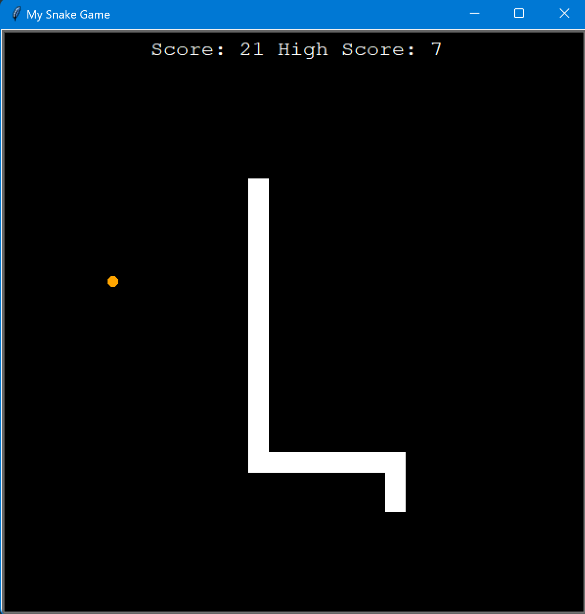

# Classic Snake Game

## Training project within 100 days of code in Python Bootcamp - days 20-21

### graphics based on turtle graphics module

## To play:
  - you need to have python 3 installed on your machine
  - download the repository
  - open terminal in the snake_game folder and run 
   `python main.py`
  - snake moves with arrow keys on your keyboard

